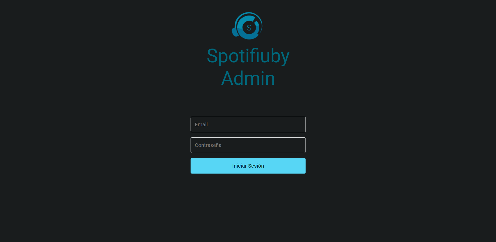

# Guía de Administrador

## Login

Para iniciar sesión se deberá ingresar el email y contraseña de un usuario que haya sido registrado como administrador por otro administrador. No es necesario estar previamente registrado en la aplicación móvil ya que los usuarios NO se comparten entre ambas plataformas, por lo que tampoco se podrá iniciar sesión en la app móvil con la cuenta de administrador y viceversa.
La sesión expira luego de una hora.

## Contenidos

En esta sección se listan todos los contenidos de la aplicación mostrando su título, tipo (álbum, canción o playlist), fecha de creación y estado (activo o bloqueado). 

Cuenta con las siguientes opciones:

**(1)** Buscar contenidos por título ingresando lo que se desee buscar en la barra de búsqueda y apretando enter o presionasndo el botón de la lupa. En el ejemplo se muestran los contenidos que contienen 'The'. Aclaración: el filtro es case sensitive.

**(2)** Filtrar contenidos por tipo (álbum, canción o playlist). Por defecto se muestran todos, como se muestra en el ejemplo. 
 
**(3)** Elegir el tamaño del paginado, que puede ser 10, 25 o 50. Por defecto es 10, como se muestra en el ejemplo. 

**(4)** Desplazarse a la página siguiente o anterior, en caso de que sea posible.

También se puede clickear sobre uno de los contenidos para desplazarse a la pantalla de [**Álbum**](#álbum), [**Canción**](#canción) o [**Playlist**](#playlist) según corresponda.

### Álbum

En esta pantalla se lista la siguiente información del álbum:

* Título.
* Usuario del artista.
* Descripción (en caso de que tenga).
* Cantidad de favoritos.
* Tipo de suscripción necesaria para acceder al álbum. Todas las canciones del álbum poseen su mismo tipo de suscripción.
* Género.
* Título de las canciones y los usuarios de los artistas colaboradores que posean.
* Comentarios con sus respectivos usuarios.

Todos los nombres de usuario se pueden clickear para navegar a la pantalla [**Perfil**](#perfil), también los nombres de canciones para navegar a la pantalla [**Canción**](#canción).

**Bloqueo de álbum:** presionando el botón 'Bloquear' se bloqueará el álbum para que no sea visible para los usuarios de la aplicación móvil. Si el álbum se encuentra bloqueado, el botón cambiará a 'Desbloquear', y al presionarlo el álbum volverá a ser visible en la aplicación. Aclaración: bloquear o desbloquear un álbum implicará realizar la acción sobre todas las canciones que posee.

### Canción

En esta pantalla se lista la siguiente información de la canción:

* Título.
* Usuario del artista.
* Descripción (en caso de que tenga).
* Título del álbum al que pertenece.
* Usuarios de los artistas colaboradores.
* Cantidad de favoritos.
* Tipo de suscripción necesaria para acceder a la canción. Esta es la misma suscripción que la del álbum al que pertenece.
* Género.
* Título de las canciones y los usuarios de los artistas colaboradores que posean.
* Comentarios con sus respectivos usuarios.

Todos los nombres de usuario se pueden clickear para navegar a la pantalla [**Perfil**](#perfil), también el título del álbum para navegar a la pantalla [**Álbum**](#álbum).

**Bloqueo de canción:** presionando el botón 'Bloquear' se bloqueará la canción para que no sea visible para los usuarios de la aplicación móvil. Si la canción se encuentra bloqueada, el botón cambiará a 'Desbloquear', y al presionarlo la canción volverá a ser visible en la aplicación. Aclaración: si el álbum al que pertenece la canción se encuentra bloqueado, desbloquear la canción implicará desbloquear el álbum, pero no el resto de sus canciones.

### Playlist

En esta pantalla se lista la siguiente información de la playlist:

* Título.
* Usuario del creador.
* Descripción (en caso de que tenga).
* Si es pública o privada.
* Cantidad de favoritos.
* Usuarios de los colaboradores.
* Título y usuario del artista de las canciones de la playlist, además del usuario de los colaboradores que posean.

Todos los nombres de usuario se pueden clickear para navegar a la pantalla [**Perfil**](#perfil), también el título de las cancines para navegar a la pantalla [**Canción**](#canción).

**Bloqueo de canción:** presionando el botón 'Bloquear' se bloqueará la playlist para que no sea visible para los usuarios de la aplicación móvil. Si la playlist se encuentra bloqueada, el botón cambiará a 'Desbloquear', y al presionarlo la playlist volverá a ser visible en la aplicación.

## Usuarios

En esta sección se listan todos los usuarios de la aplicación mostrando su nombre de usuario, nombre, apellido, estado de la solicitud (aceptada, rechazada, pendiente o no solicitada) y su estado (activo o bloqueado). 

Cuenta con las siguientes opciones:

**(1)** Buscar usuarios por nombre de usuario ingresando lo que se desee buscar en la barra de búsqueda y apretando enter o presionasndo el botón de la lupa. En el ejemplo se muestran los usuarios que contienen 'Me'. Aclaración: el filtro es case sensitive.

**(2)** Filtrar usuarios por estado de la solicitud (aceptada o rechazada). Por defecto se muestran todos, como se muestra en el ejemplo. 
 
**(3)** Elegir el tamaño del paginado, que puede ser 10, 25 o 50. Por defecto es 10, como se muestra en el ejemplo. 

**(4)** Desplazarse a la página siguiente o anterior, en caso de que sea posible.

También se puede clickear sobre uno de los usuarios para desplazarse a la pantalla de [**Perfil**](#perfil).

### Perfil

En esta pantalla se lista la siguiente información del usuario:

* Foto de perfil.
* Nombre de usuario.
* Nombre.
* Apellido.
* Foto y nombre de usuario de los usuarios seguidos.
* Foto y título de los álbumes publicados.
* Foto y título de las playlists creadas.

Todos los usuarios se pueden clickear para navegar a la pantalla [**Perfil**](#perfil), los álbumes para navegar a la pantalla [**Álbum**](#álbum) y las playlists para acceder a la pantalla [**Playlist**](#playlist).

**Bloqueo de usuario:** presionando el botón 'Bloquear' se bloqueará el usuario para que no pueda ingresar a la aplicación móvil. Si el usuario se encuentra bloqueado, el botón cambiará a 'Desbloquear', y al presionarlo el usuario podrá ingresar a la aplicación.

**Solicitud de artista verificado:** si el artista subió un video para solicitar la verificación de su cuenta, en su perfil aparecerá el botón 'Ver solicitud', que al clickearlo se abrirá un cartel donde se podrá reproducir el video y aceptar o rechazar la solicitud. Para cancelar se puede clickear fuera del cartel.

## Métricas

### Métricas de usuarios

En esta sección y clickeando el botón 'Usuarios' (está activado por defecto) se muestran las métricas de usuarios, que incluyen:

* Cantidad de usuarios totales.
* Cantidad de usuarios bloqueados.
* Gráfico de la cantidad de inicios de sesión por día con email y con Google (cada usuario se cuenta una única vez en el día que inició sesión por última vez).
* Gráfico de la cantidad de registros por día con email y con Google.

Acercando el mouse encima de los gráficos se puede ver el detalle para un día en específico.

### Métricas de contenidos

En esta sección y clickeando el botón 'Contenidos' se muestran las métricas de contenidos, que incluyen:

* Cantidad de álbumes totales.
* Cantidad de canciones totales.
* Cantidad de playlists totales.
* Gráficos de la cantidad de álbumes, canciones y playlists por género.
* Gráficos de la cantidad de álbumes, canciones y playlists por suscripción.

En ningún caso se cuentan los contenidos que hayan sido eliminados.

Acercando el mouse encima de los gráficos se puede ver el detalle para un día, género o suscripción específicos.

## Registro

En esta sección se puede registrar un nuevo administrador ingresando con el email ingresado:

En caso de registro exitoso, aparecerá un cartel donde se mostrará el email y la contraseña generada, con la opción de copiarla al portapales. Con esas credenciales se podrá ingresar a la plataforma. Para cerrar el cartel se puede clickear fuera del mismo.
