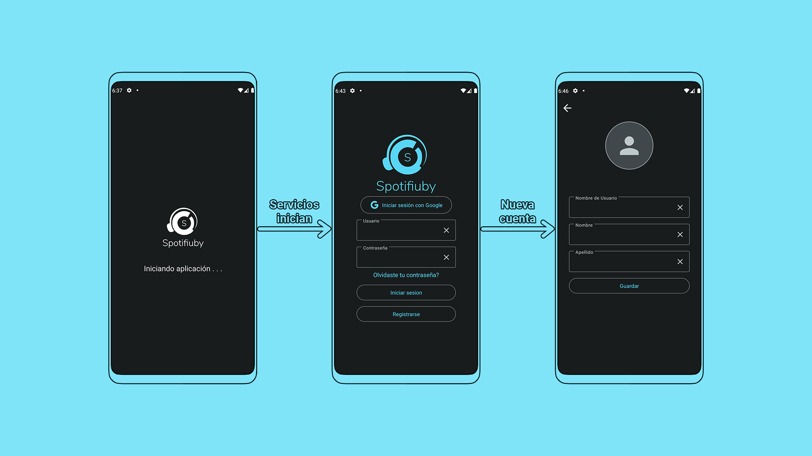
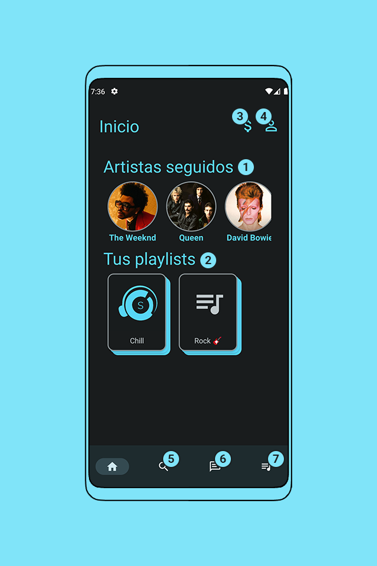
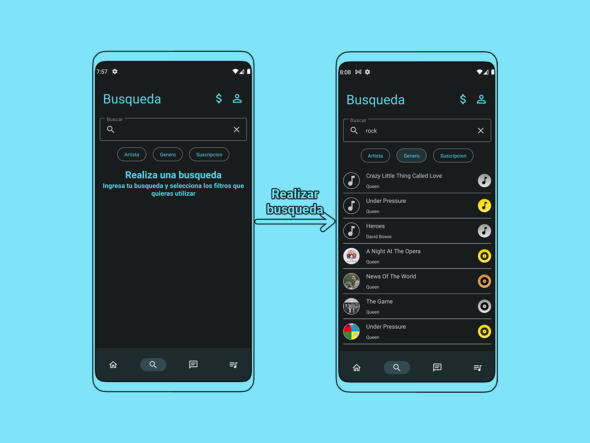
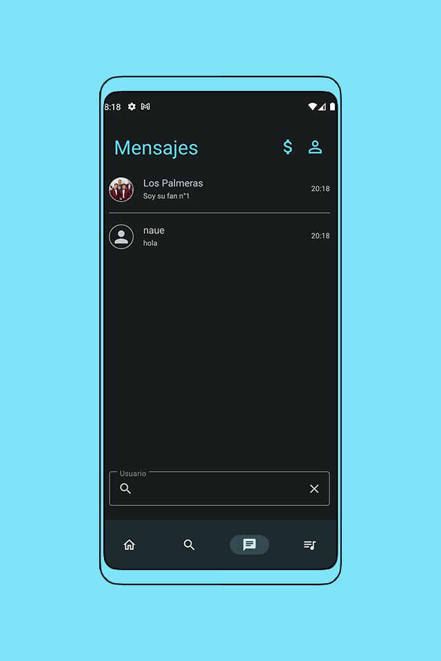
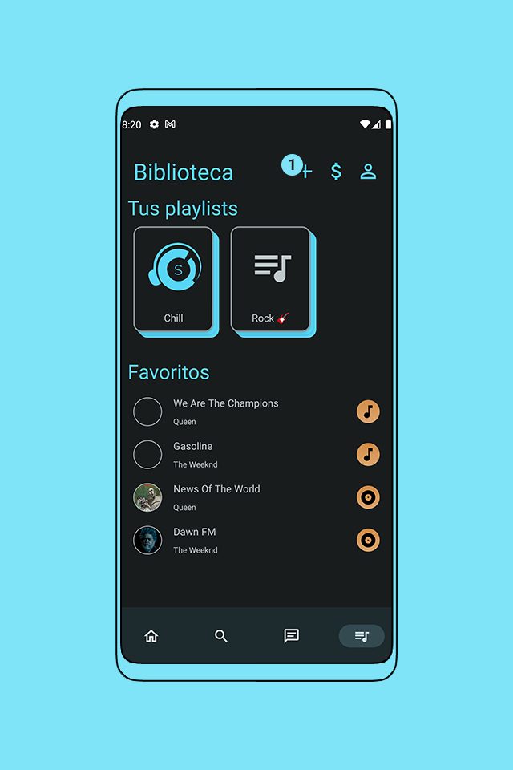

# Guía de Usuario

Al iniciar la aplicación, se debe esperar a que los servicios de Spotifiby se inicien, esto debido a que en caso de no tener actividad durante 1 hora, los servicios entraran en estado de hibernación. Al finalizar, se le pedirá que inicie sesión con un usuario y contraseña o con una cuenta de Google, en caso de no tener una cuenta, se le pedirá que cree una.

## Home

  

La pantalla de inicio es la pantalla principal de la aplicación, en ella podras ver algunos de tus artistas seguidos **(1)** y tus playlists **(2)**.
Ademas, tambien podras ver la información de tu perfil **(3)** y la información de tu suscripción actual en donde podras modificarla **(4)**.
En la barra inferior, hay una lista de opciones, en donde la primera es la seleccionada ya que corresponde a la pantalla de inicio, luego **(5)** es la pantalla de busquedas, **(6)** es la pantalla de mensajes privados y **(7)** es la pantalla de biblioteca.

## Busqueda

En esta pantalla podras realizar busquedas para encontrar contenido o artistas.
Existen diferentes filtros para ajustar la busqueda, por ejemplo, si artista esta seleccionado, se buscaran artistas cuyo nombre contenga el texto ingresado, si genero esta seleccionado, se buscaran canciones y albumes cuyo genero contenga el texto ingresado. Si ninguno de estos dos es seleccionado, se buscaran canciones, albumes y playlists cuyo nombre contenga el texto ingresado. Ademas, si la opcion de Suscripción esta activa, solo se mostrara contenido que corresponda a suscripción.

## Mensajes Privados

  

En esta pantalla se muestran los mensajes privados que has enviado o recibido.
Ademas en la parte inferior, se encuentra una barra de busqueda en donde podras buscar usuarios para enviarles un mensaje.

## Biblioteca

  

En esta pantalla se muestran las playlists que hayas creado y ademas todos los contenidos que hayas agregado a favoritos.
Ademas se pueden crear nuevas playlists presionando **(1)**