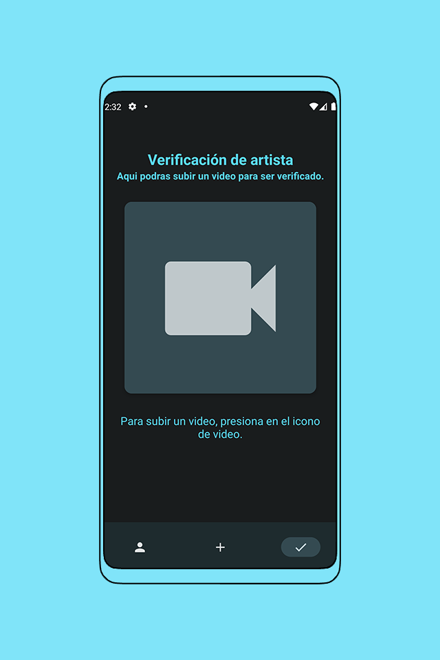

# Guía de Usuario

Al iniciar la aplicación, se debe esperar a que los servicios de Spotifiby se inicien, esto debido a que en caso de no tener actividad durante 1 hora, los servicios entraran en estado de hibernación. Al finalizar, se le pedirá que inicie sesión con un usuario y contraseña o con una cuenta de Google, en caso de no tener una cuenta, se le pedirá que cree una.

## Home

  

La pantalla de inicio es la pantalla principal de la aplicación, en ella podras ver algunos de tus artistas seguidos **(1)** y tus playlists **(2)**.
Ademas, tambien podras ver la información de tu perfil **(3)** y la información de tu suscripción actual en donde podras modificarla **(4)**.
En la barra inferior, hay una lista de opciones, en donde la primera es la seleccionada ya que corresponde a la pantalla de inicio, luego **(5)** es la [**pantalla de busquedas**](#busqueda), **(6)** es la [**pantalla de mensajes privados**](#mensajes-privados) y **(7)** es la [**pantalla de biblioteca**](#biblioteca).

## Busqueda

En esta pantalla podras realizar busquedas para encontrar contenido o artistas.
Existen diferentes filtros para ajustar la busqueda, por ejemplo, si artista esta seleccionado, se buscaran artistas cuyo nombre contenga el texto ingresado, si genero esta seleccionado, se buscaran canciones y albumes cuyo genero contenga el texto ingresado. Si ninguno de estos dos es seleccionado, se buscaran canciones, albumes y playlists cuyo nombre contenga el texto ingresado. Ademas, si la opcion de Suscripción esta activa, solo se mostrara contenido que corresponda a suscripción.

## Mensajes Privados

  

En esta pantalla se muestran los mensajes privados que has enviado o recibido.
Ademas en la parte inferior, se encuentra una barra de busqueda en donde podras buscar usuarios para enviarles un mensaje.

## Biblioteca

  

En esta pantalla se muestran las playlists que hayas creado y ademas todos los contenidos que hayas agregado a favoritos.
Ademas se pueden crear nuevas playlists presionando **(1)**

## Playlist

Se muestran en orden de izquierda a derecha las pantallas de 'Nueva playlist', 'Ver playlist' y 'Editar playlist'.
En la pantalla de ver playlist se muestran los contenidos de la playlist, ademas presionando **(1)** podemos editarla, presionando **(2)** podemos eliminarla y presionando **(3)** reproducirla.
Luego, tanto en la pantalla de nueva playlist como en la de editar playlist, se puede ingresar informacion como foto de portada, titulo, descripción y canciones. Ademas de poder hacerla publica o de agregar personas como compartidos (los cuales seran los usuarios que podran ver y reproducir la playlist en caso de que la playlist no sea publica), o tambien como colaboradores (los cuales seran los usuarios que podran agregar contenido a la playlist y modificar informacion titulo, foto y descripcion).

## Reproducción de contenido

  

En esta pantalla se mostrara la canción que se esta reproduciendo, ademas de la informacion de la cancion, artista y album. Tambien se podra controlar la reproducción de la canción presionando los botones de play, pause, anterior y siguiente. En la parte inferior se encuentra la sección en donde podras escribir un comentario sobre la cancion.

## Perfil propio

En la primera pantalla se muestra la información de tu perfil, ademas de 4 opciones las cuales son:
  + **(1)** Editar perfil: Ingresar a la pantalla de edición de perfil.
  + **(2)** [**Entrar en modo artista**](#perfil-del-artista): Lo cual te permitira subir canciones y albumes a la plataforma.
  + **(3)** Ver la wallet: En donde podras ver informacion de la wallet como el balance y las transacciones realizadas.
  + **(4)** Cerrar sesión
La segunda pantalla es la pantalla de edición de perfil, en donde podras editar tu nombre de usuario, nombre, apellido y foto. Ademas, presionando el boton de configuración, podras entrar a la tercera pantalla en donde podras modificar correo electronico y contraseña.

## Suscripciones

En esta pantalla se vera la información de tu suscripcion actual, ademas de la opcion de modificarla por alguna de las opciones disponibles.

## Contenido del artista

En la primera pantalla, se ve el perfil de un artista el cual es posible seguirlo y enviarle un mensaje, ademas de una lista de todo los contenidos que tiene.
En la segunda pantalla, se ve la vista de un album, en donde se ve informacion basica como titulo, artista, puntajes y una lista de todas las canciones que contiene. Ademas se puede agregar a favoritos presionando la estrella de favoritos al lado de la información, y dejar un comentario o un puntaje en la parte inferior.

## Perfil del artista

  

Esta pantalla se accede luego de entrar al modo artista, aca se listan los albumes que tenes subidos, a los cuales podes acceder para editar su informacion y/o agregar canciones. Ademas podes editar tu perfil o volver al modo usuario.
En la barra inferior, hay una lista de opciones, en donde la primera es la seleccionada ya que corresponde a esta pantalla de perfil del artista **(1)**, luego **(2)** es la [**pantalla de nuevo album**](#nuevo-album) y **(3)** es la [**pantalla de verificación de artista**](#verificación-de-artista).

## Nuevo album

En esta pantalla se podra crear un nuevo album ingresando la informacion basica como titulo, descripcion, genero, tipo de suscripcion y foto de portada. Ademas se puede agregar canciones al album presionando el boton de nueva cancion.
Cada canción del album tendra titulo, descripcion y una lista de colaboradores, en caso de que no se quiera agregar ningun colaborador, se puede dejar vacio.

## Verificación de artista

En esta pantalla se podra subir un video para ser verificado en la plataforma, luego este sera analizado por un administrador y se le aceptara o se rechazara. En caso de ser aceptado, pasaras a ser un artista verificado y se podra ver un ✓ en tu perfil, en el caso contrario, podras subir un nuevo video.